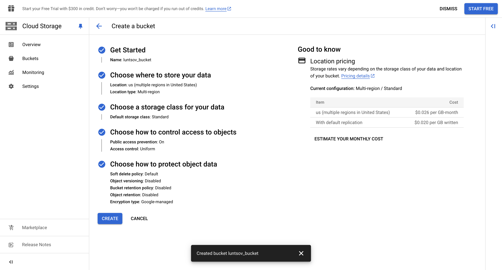

University: [ITMO University](https://itmo.ru/ru/) 

Faculty: [FICT](https://fict.itmo.ru)

Course: [Cloud platforms as the basis of technology entrepreneurship](https://itmo-ict-faculty.github.io/cloud-platforms-as-the-basis-of-technology-entrepreneurship/)

Year: 2024/2025

Group: U4225

Author: Luntsov Ilya Evgenevich

Lab: Lab3

Date of create: 06.11.2024

Date of finished: 06.11.2024

---

Целью лабораторной работы является исследование возможностей Cloud Storage в Google Cloud Platform. В работе был создан bucket, загружены изображения, настроен публичный доступ и сгенерированы ссылки для общего доступа.

### Шаг 1: Выбор существующего проекта и создание Cloud Storage bucket
1. Перешел в раздел **Storage > Browser**.
2. Нажал **Create bucket** и создал bucket с именем `luntsov_bucket`:
   - Имя: `luntsov_bucket`
   - Размещение: `Multi-region`
   - Класс хранения: `Standard`
   - Управление доступом: `Uniform`

   

### Шаг 2: Загрузка изображений в Cloud Storage bucket
1. Перешел в созданный bucket `luntsov_bucket` и нажал **Upload files**.
2. Загрузил три изображения с именами:
   - `20th Century Boys (2).jpeg`
   - `20th Century Boys (3).jpeg`
   - `20th Century Boys (4).jpeg`

   
   

### Шаг 3: Создание папки и перемещение файлов
1. В bucket `luntsov_bucket` нажал **Create folder** и создал папку с именем `luntsov_folder`.

  
   
2. Переместил загруженные файлы в папку `luntsov_folder`, выбрав файлы и используя кнопку **Move**.

   
   
   
   

### Шаг 4: Настройка публичного доступа к файлам
1. Открыл **Permissions** и для бакета `luntsov_bucket` выполнил следующие действия:
   - Нажал **Grant Access**.
   - Выбрал **Add principals**.
   - Добавил принципал `allUsers` с ролью **Storage Object Viewer**, чтобы сделать файлы публично доступными.
   - Сохранил изменения.

   
   
   

### Шаг 5: Создание ссылок на файлы
1. Для каждого файла в папке `luntsov_folder` нажал **More actions** и выбрал **Copy Public URL**.
2. Скопировал и сохранил ссылки на файлы для доступа:
   - [20th Century Boys (2).jpeg](https://storage.googleapis.com/luntsov_bucket/luntsov_folder/20th%20Century%20Boys%20(2).jpeg)
   - [20th Century Boys (3).jpeg](https://storage.googleapis.com/luntsov_bucket/luntsov_folder/20th%20Century%20Boys%20(3).jpeg)
   - [20th Century Boys (4).jpeg](https://storage.googleapis.com/luntsov_bucket/luntsov_folder/20th%20Century%20Boys%20(4).jpeg)

   

## Выводы
В ходе лабораторной работы была изучена возможность создавать и настраивать Cloud Storage bucket, загружать и структурировать файлы, настраивать доступ и генерировать ссылки для общего доступа. Этот процесс позволяет организовать хранение и предоставление доступа к данным в облачной среде.
