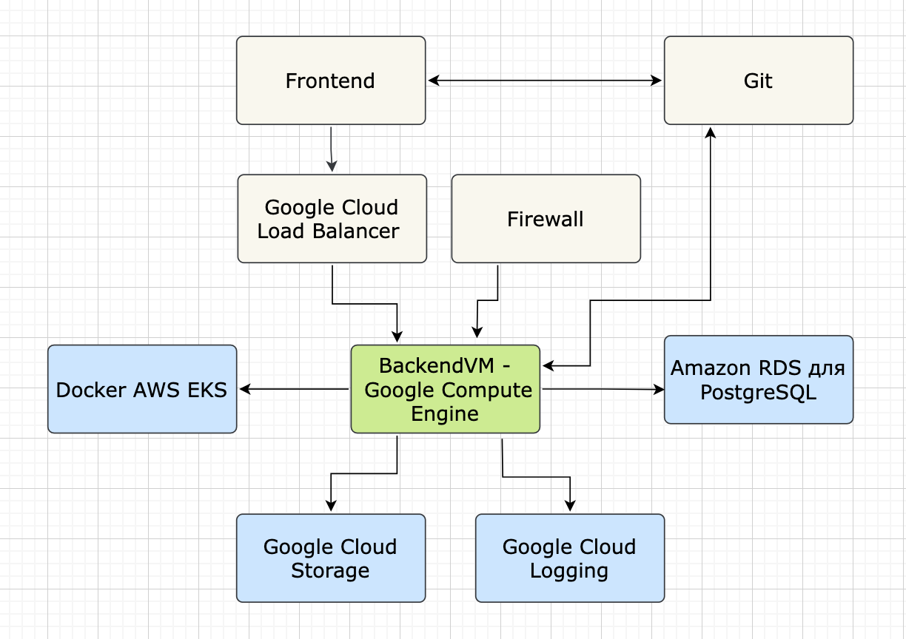

University: [ITMO University](https://itmo.ru/ru/) 

Faculty: [FICT](https://fict.itmo.ru)

Course: [Cloud platforms as the basis of technology entrepreneurship](https://itmo-ict-faculty.github.io/cloud-platforms-as-the-basis-of-technology-entrepreneurship/)

Year: 2024/2025

Group: U4225

Author: Luntsov Ilya Evgenevich

Lab: Lab4

Date of create: 06.11.2024

Date of finished: 06.11.2024

 
  
---

В этой лабораторной работе необходимо было составить инфраструктурную схему для приложения, используя draw.io, рассчитать экономическую модель и обосновать выбор облачных ресурсов для трех состояний приложения: начальное, тестирование партнерами и продовое решение.

### Описание приложения
Приложение — **"ПланПит"** — предназначено для помощи пользователям в составлении сбалансированного плана питания, с учетом их целей, здоровья, аллергий и предпочтений. Основные функциональные возможности:
- Регистрация и ввод данных о здоровье.
- Создание индивидуальных планов питания с учетом целей пользователя.
- Отслеживание потребления пищи и калорий.
- Советы и напоминания по улучшению питания.

Технические возможности:
- Язык программирования - Python с использованием Django или Flask.
- Модель ИИ - Простая модель рекомендаций.
- Хранилище данных - PostgreSQL.
- Пользовательский интерфейс - мобильное приложение или веб-приложение.

### 1. Инфраструктурная схема
Для разработки инфраструктурной схемы были выбраны компоненты, которые обеспечат необходимые ресурсы для приложения на каждом этапе его жизненного цикла, и отражены на Схеме, нарисованной в draw.io:

#### Компоненты инфраструктурной схемы:

 **1. Google Cloud Load Balancer** - этот компонент используется для распределения трафика между серверами, обеспечивая высокую доступность и устойчивость приложения. Load Balancer помогает управлять нагрузкой и улучшает производительность, особенно на этапе тестирования и в продовой среде.
   - **Начальный этап**: Возможно, можно начать с простого регионального балансировщика нагрузки, который обойдется дешевле и подойдет для тестирования.
   - **Расходы**: Обычно Google Cloud взимает плату за обработку запросов и потребление ресурсов. В среднем стоимость может варьироваться от $0.025 до $0.04 за обработанные ГБ.

**2. Google Compute Engine (BackendVM)** - виртуальная машина используется для выполнения запросов от frontend и выполнения логики приложения. Это гибкое решение, которое легко масштабируется и может работать как с контейнерами, так и с другими облачными сервисами.
   - **Начальный этап**: Для начальной разработки можно использовать маленький инстанс, например, e2-micro, с низкой стоимостью. Для тестирования и продакшн-версии потребуется более мощный инстанс, например, e2-medium или n1-standard.
   - **Расходы**: e2-micro обойдется примерно в $4–$5 в месяц. В продакшн можно рассмотреть более мощные машины, с ценой до $30–$50 в месяц.

**3. AWS EKS (Контейнер)** - Amazon EKS — это сервис для оркестрации контейнеров на базе Kubernetes, который обеспечивает автоматическое масштабирование и управление контейнерами. Контейнеризация помогает легко управлять микросервисами приложения.
   - **Начальный этап**: Поскольку это тестовый этап, можно развернуть EKS с минимальной конфигурацией и количеством узлов.
   - **Расходы**: Стоимость кластера EKS составляет $0.10 в час за мастер-узел + стоимость ресурсов (например, EC2-инстансов) для рабочих узлов. При минимальной конфигурации с 1–2 узлами это может обойтись в $25–$50 в месяц.

4. **Amazon RDS для PostgreSQL** - Amazon RDS позволяет развернуть управляемую базу данных PostgreSQL с высокой надежностью, автоматическим резервным копированием и масштабированием. Подходит для хранения данных пользователей, рецептов и истории питания.
  - **Начальный этап**: В начальной фазе можно использовать т2-микро инстанс, а на более поздних стадиях — инстансы с увеличенной мощностью.
  - **Расходы**: При использовании t2.micro в рамках бесплатного уровня RDS будет стоить около $12–$15 в месяц при минимальной нагрузке.

**5. Google Cloud Storage (Хранилище файлов)** - этот сервис используется для хранения файлов, таких как изображения, или других пользовательских данных. Он предлагает надежное, масштабируемое хранилище, поддерживает разные классы хранения для оптимизации затрат.
   - **Начальный этап**: Хранилище стандартного класса для разработки и тестирования.
   - **Расходы**: Стоимость около $0.02 за ГБ в месяц для стандартного хранения.

**6. Google Cloud Logging (Система логирования)** - Google Cloud Logging собирает и анализирует логи приложения, что помогает отслеживать работу сервиса, выявлять ошибки и улучшать производительность.
   - **Начальный этап**: На начальном этапе можно ограничиться базовым логированием, увеличивая объем по мере необходимости.
   - **Расходы**: Стандартное логирование обойдется примерно в $0.50 за ГБ хранения логов.

### 2. Экономическая модель
На основе выбранных сервисов были рассчитаны расходы на содержание инфраструктуры для каждого этапа.

**Начальный этап:**
| Ресурс                    | Ежемесячная стоимость |
|---------------------------|-----------------------|
| Google Cloud Load Balancer | $10–$15              |
| Google Compute Engine VM   | $5–$10               |
| AWS EKS                    | $25–$50              |
| Amazon RDS (PostgreSQL)    | $12–$15              |
| Google Cloud Storage       | $2                   |
| Google Cloud Logging       | $5                   |
| **Итого**                  | **$59–$97**          |

**Этап тестирования партнерами** - затраты увеличиваются из-за необходимости масштабирования ресурсов для тестирования с увеличенным количеством пользователей.
- **Google Compute Engine (BackendVM)**: повышение мощности виртуальных машин.
- **AWS EKS**: увеличение числа рабочих узлов.
- Расходы на другие сервисы остаются прежними.

**Продовое решение** - на этом этапе затраты увеличиваются, так как необходимо обеспечить высокую доступность и масштабируемость.
- **Google Cloud Load Balancer**: выбор глобального балансировщика нагрузки.
- **Google Compute Engine**: инстансы с повышенной вычислительной мощностью.
- **Amazon RDS для PostgreSQL**: более мощные инстансы и автоматическое масштабирование.
- **AWS EKS**: увеличение числа узлов и мощности для обеспечения стабильности и производительности.
- Общие расходы будут значительно выше, чем на начальном этапе, но они обеспечат необходимую надежность и производительность для обслуживания большого количества пользователей.

### 3. Обоснование выбора ресурсов

**Начальный этап:**
- Для начального этапа были выбраны доступные и недорогие решения, которые позволяют минимизировать затраты, но при этом поддерживать все необходимые функциональные возможности. Например, использование e2-micro инстансов в Google Compute Engine позволяет разработчикам начать работу с ограниченным бюджетом.

**Этап тестирования партнерами:**
- На этапе тестирования важно обеспечить более высокую производительность и стабильность, так как нагрузка увеличивается. Поэтому виртуальные машины Google Compute Engine и контейнеризация с помощью AWS EKS были увеличены для обеспечения лучшей обработки трафика. Это позволяет гарантировать, что приложение будет работать корректно при увеличении числа пользователей.

**Продовое решение:**
- На продовом этапе необходимы ресурсы с высокой надежностью и масштабируемостью. Использование глобального Google Cloud Load Balancer, мощных инстансов Google Compute Engine и масштабируемой базы данных Amazon RDS для PostgreSQL обеспечивает необходимую отказоустойчивость и производительность. Это позволяет обработать большое количество запросов и данных, а также обеспечить бесперебойную работу системы.

### Выводы
В рамках лабораторной работы была создана инфраструктурная схема для приложения "ПланПит" на облачных платформах Google Cloud и AWS. Задача заключалась в разработке гибкой инфраструктуры для трех этапов: начального, тестирования и продового решения.

На начальном этапе были выбраны дешевые ресурсы для минимизации затрат, включая Google Compute Engine и AWS EKS. 

На этапе тестирования нагрузка увеличилась, и были выбраны более мощные виртуальные машины и Kubernetes-кластеры. Расходы выросли, но обеспечили качественное тестирование.

Для продового решения приоритетом была надежность и масштабируемость. Были использованы Google Cloud Load Balancer, Google Compute Engine и Amazon RDS для высокой производительности и отказоустойчивости. Затраты на этом этапе выше, но гарантируют стабильную работу системы.

Таким образом, экономическая модель показала, что на начальном этапе можно использовать дешевые решения, тогда как на других этапах рост затрат оправдан повышенными требованиями. Облачные сервисы обеспечивают гибкость и масштабируемость системы. Разработанная схема оптимальна для каждого этапа развития приложения и готова к масштабированию в будущем.
